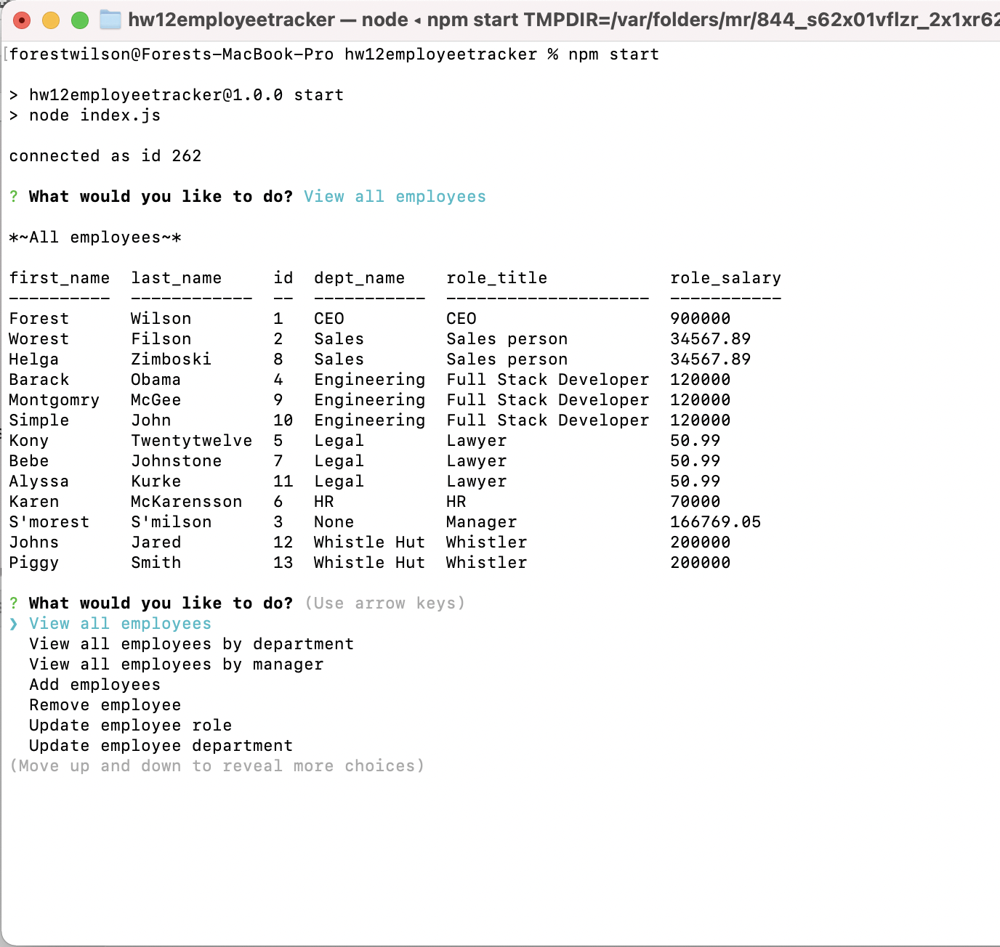

# Forest Wilson - Homework 12 - Employee Tracker
MIT - (https://opensource.org/licenses/MIT) - For Evil.
<!-- Original deployment date: June 15th, 2021 -->

## Table of Contents:
- [This week's concepts](#this-weeks-concepts)
- [Tech used](#tech-used)
- [Project description](#project-description)
- [Usage instructions](#usage-instructions)
- [Project installation](#project-installation)
- [Additional comments](#additional-comments)
- [Contribution information](#contribution-information)
- [Questions](#questions-or-concerns)
- [Pictures, Links](#extras)

### About This Project

* # This weeks concepts:
  1. MySql workbench, Node connection
  2. MySql queries
  3. Env variables

* # Tech used:
  1. JavaScript
  2. Node.js
  3. MySql
  4. MySql workbench
  5. Npm
    * - inquirer
      - dotenv
      - console.table

* # Project description:
  Given an ever growing company of employees that I now need to keep track of, I have developed a command line application that will let you manage a complex roster of employees using MySql queries and the CRUD paradigm. With Inquirer as the prompting structure, you can have full control over who works for you, and who's getting fired.
  
* # Usage instructions
  Start the app, and proceed through the menus to your desire. "view all" will display all of your current employees, refreshed after every action.
  
* # Project installation
  1. npm i,
  2. npm run seed - if you would like to start with employees,
  3. npm run start,
  4. enjoy.
 
* # Additional comments
(Jun/15/21)

  - This project took a lot longer than expected. I saw it was another inquirer and thought it would be a breeze, but the mysql side of things made this a lot harder. Even with inquirer knowledge, it was hard for me to plan the input logic behind the many functions we needed to implement.

  - I would have liked to be more consistent with my approach with this project, but every function i created showed me a better or different way to do something, so there are many differing formats I used through the script. In the future i would like to plan ahead and find what format I should use for everything. (eg. all forms of throw err I used or different approaches to queries and action functions.)

  - regex function taken from stackoverflow (ln: 550). hopefully when i get to that hw I will better understand what its doing lol.

  - One thing I really wanted to add was the display of who is a manager and who manages which employee. I used a colomn "has_boss" to match up with the colomn "manager_id" which would only have a value if they were a manager of that department, however I couldnt figure out how to assosiate values inside one table. I also couldnt figure out how i can add manager as a persons role while also keeping their department info. Probably just need to rethink the logic of which tables hold which assosiations in the future.

  - During the demo vid I noticed that deleting the department resulted in the employee being deleted as well. Ususally what happened was the employee would persist but would have NULL in all job related fields. I'm not sure if this was a bug with my queries or if it is a bug with the console.table/log displaying in the console.

#### Contribution information 
- If you would like to contribute to this project, please follow best practices and message me at one of the provided contacts bellow if you want to push!

###### Questions or concerns? 
* Please contact me at one of the following!
  - Email - hexaforest@gmail.com
  - gitHub - https://github.com/ForestW70/

# Extras
* Screenshots:
  - 

* Demo:
  - [App demo video](https://youtu.be/x-xalO1bMd8)

* Links:
  - [Repo page](https://github.com/ForestW70/Week-12-Employee-Tracker)
  
